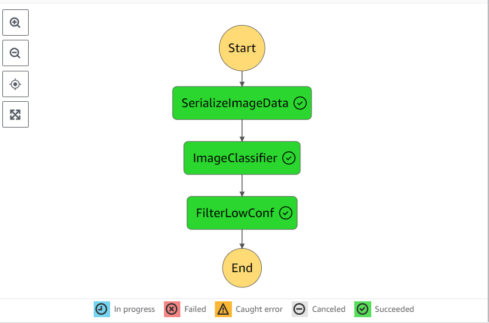
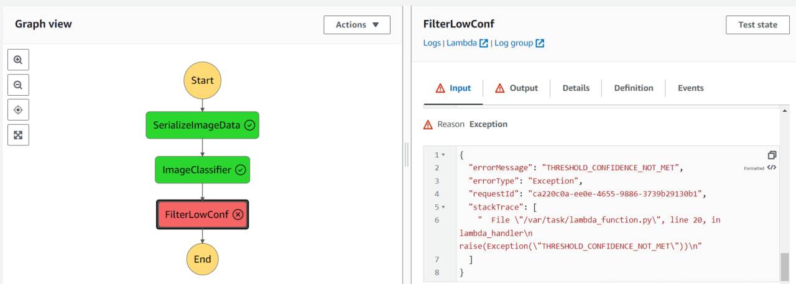

# Build-a-ML-Workflow-For-Scones-Unlimited-On-Amazon-SageMaker

## 📌 Project Overview
This project is a core component of the **Udacity AWS Machine Learning Engineer Nanodegree**. 

As a Machine Learning Engineer for **Scones Unlimited**, a specialized logistics company, I developed an image classification system to optimize delivery routing. The system automatically distinguishes between **bicycles** and **motorcycles** in images. This allows the logistics team to:
* Assign **bicycles** to nearby, short-range orders.
* Assign **motorcycles** to farther, long-range orders.

The solution is built as a **scalable, event-driven application** on AWS, ensuring that as the company grows, the model remains reliable and monitored for performance degradation.

---

## 🛠️ Tech Stack & AWS Services
* **AWS SageMaker:** Model training, hyperparameter tuning, and endpoint hosting.
* **AWS Lambda:** Serverless processing for data transformation and inference calls.
* **AWS Step Functions:** Orchestrating the ML workflow into a cohesive state machine.
* **Amazon S3:** Scalable storage for training data and model artifacts.
---

## 🏗️ System Architecture

1.  **Data Staging:** Extraction and transformation of the CIFAR-100 dataset.
2.  **Model Training:** Training a SageMaker Image Classifier using high-performance compute instances.
3.  **Inference Pipeline:** A three-stage **AWS Step Function** workflow:
    * **Lambda 1 (Image Serializer):** Converts image data into a format suitable for the model.
    * **Lambda 2 (Inference Provider):** Sends the data to the SageMaker endpoint and retrieves predictions.
    * **Lambda 3 (Confidence Filter):** Evaluates the prediction confidence. If the probability is below a specific threshold (e.g., 80%), the process flags it for manual review.

---

## Building a State Machine via AWS Step Functions:
- Step Function Graph (that met inference threshold)

- Step Function Graph (that not met inference threshold)

